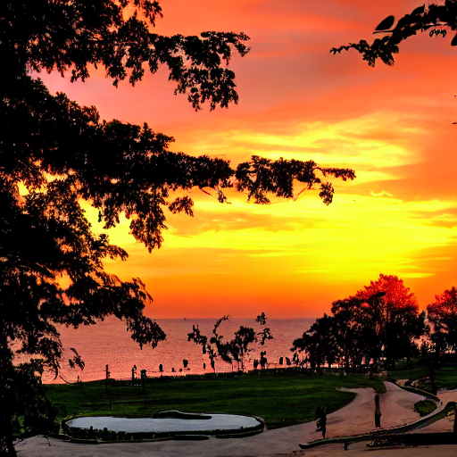

<aside>
🤔 피어리뷰 템플릿
- 코더 : 안진덕, 윤석진
- 리뷰어 : 김우찬, 조규원, 박단영

- [x]  **1. 주어진 문제를 해결하는 완성된 코드가 제출되었나요? (완성도)**
    - 
    - 이미지 생성이 잘 되었습니다.
    - 플러터 앱에서는 원하는 영상을 제작할 수 있어보이지만, fastAPI와의 시간 문제로 인해 오류가 발생합니다. 최종 생성물은 확인하였습니다.

- [x]  **2. 프로젝트에서 핵심적인 부분에 대한 설명이 주석(닥스트링) 및 마크다운 형태로 잘 기록되어있나요? (설명)**
    - [x]  모델 선정 이유 : 이번 퀘스트에서 stable diffusion 외 다른 모델을 사용할 이유가 없었습니다.
    - [x]  하이퍼 파라미터 선정 이유 : 변경 없이 잘 프로젝트가 진행되었습니다.
    - [x]  데이터 전처리 이유 또는 방법 설명 : 전처리 과정은 노드에 적혀져있는대로 잘 진행하면 문제가 없었습니다.

- [x]  **3. 체크리스트에 해당하는 항목들을 수행하였나요? (문제 해결)**
    - [x]  데이터를 분할하여 프로젝트를 진행했나요? (train, validation, test 데이터로 구분) : 해당사항 없습니다(사전학습모델 사용)
    - [x]  하이퍼파라미터를 변경해가며 여러 시도를 했나요? (learning rate, dropout rate, unit, batch size, epoch 등) : 해당사항 없습니다(사전학습모델 사용)
    - [x]  각 실험을 시각화하여 비교하였나요? : 해당사항 없습니다(사전학습모델 사용), 다양한 이미지 생성 확인하였습니다.
    - [x]  모든 실험 결과가 기록되었나요? : 네

- [ ]  **4. 프로젝트에 대한 회고가 상세히 기록 되어 있나요? (회고, 정리)**
    - [ ]  배운 점
    - [ ]  아쉬운 점
    - [ ]  느낀 점
    - [ ]  어려웠던 점

- [x]  **5.  앱으로 구현하였나요?**
    - [x]  구현된 앱이 잘 동작한다. : 다만 로컬의 CPU 문제로 인해, 시간 지연으로 사진이 출력되지 않는 문제가 있었습니다.
    - [x]  모델이 잘 동작한다.
       [pic2](./스크린샷%202024-12-06%20162112.png)
       [pic3](./스크린샷%202024-12-06%20162610.png)
### 리뷰어 회고
- 김우찬 : 전반적으로 잘 수행된 퀘스트 인 것 같습니다. GPU를 사용하지 못한 아쉬움이 있지만, 이는 아이펠톤에서 대체 방법이 있을 것 같습니다.
- 조규원 : 짧은시간에 플러터까지 구현하시다니 대단합니다. 이제 RTX 4080만 있으면 될 것 같아요.
- 박단영 : 플러터 할 생각도 못 했는데 플러터까지 하신 게 대단하십니다..!!

</aside>
